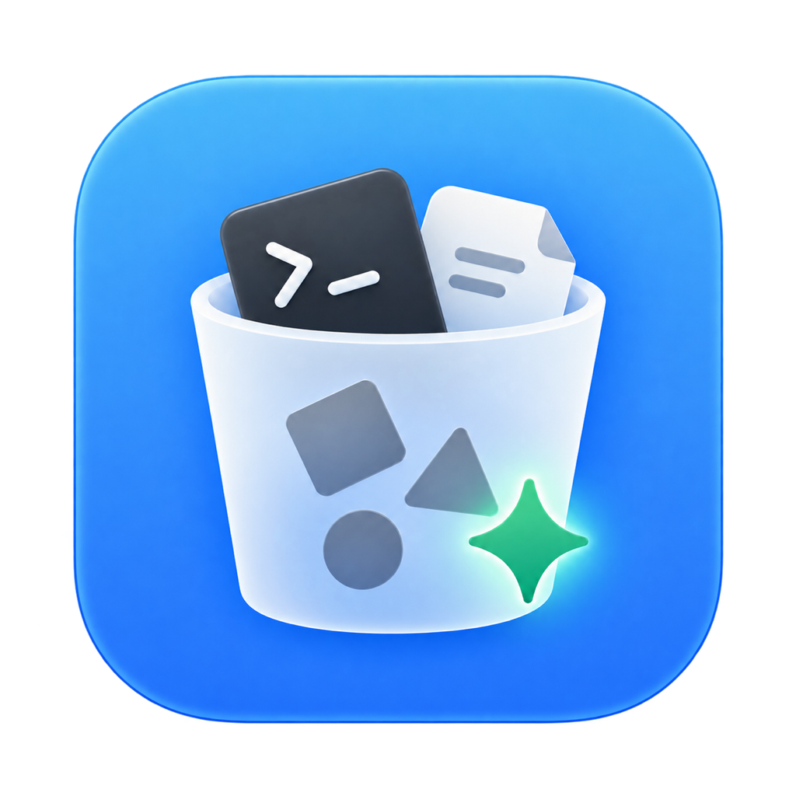

<p align="center">
  <p align="center">
    
  </p>
  <h1 align="center"><b>Clean the Agent</b></h1>
  <p align="center">
    A conservative cleanup tool for artifacts and configuration changes left by developer tools.
    <br />
    <br />
    <b>Download for </b>
    <del>
    <i>
    macOS
    ·
    Windows
    ·
    Linux
    </i>
    </del>
    <br />
  </p>
</p>

## Supported

### Providers

| Status | Scope | Supported |
| --- | --- | --- |
| ✅ | Orca | App data, caches, logs, temporary files, workspaces, Git worktrees, hooks, integration config, runtime state, skills, and trust state |

### Tweaks

| Status | Scope | Supported |
| --- | --- | --- |
| ✅ | Codex | Optional preference tweak to disable the Pet shortcut |

Clean the Agent only applies cleanup with clear ownership and a conservative risk assessment. Scans are read-only, cleanup starts as a plan, and worktrees, trust records, history, and other review-required items are never removed automatically.

## Download and use

Download a package for your platform from [GitHub Releases](https://github.com/wibus-wee/clean-the-agent/releases).

### CLI

Extract the CLI package and put `clean-the-agent` on your `PATH`:

```console
clean-the-agent              # Open the interactive menu
clean-the-agent scan         # Scan and show findings
clean-the-agent clean        # Build a cleanup plan (no changes)
clean-the-agent clean --apply
```

Use `clean-the-agent interactive` to open the menu explicitly. The CLI also supports `--json`, `--verbose`, `--include-review`, `--home`, `--wsl-home`, and `--remote-home`. Run this for the complete list:

```console
clean-the-agent --help
```

### GUI

macOS 14+ users can download the GUI DMG and drag it into Applications. The GUI and CLI share the same scanning, cleanup, and safety checks.

## Contributions

Agent products often leave worktrees, hooks, skills, plugins, caches, logs,
runtime state, trust records, background services, or edits to another tool's
configuration after uninstall. This project welcomes reports and cleanup
providers for all of them—not only the products already supported.

You do not need to write Rust to contribute. A useful report can simply contain
a redacted path or configuration shape and reliable evidence that the agent
created it. Open an
[agent residue report](https://github.com/wibus-wee/clean-the-agent/issues/new?template=agent-residue.yml)
with the product and version, operating system, install and uninstall method,
observed residue, ownership evidence, and whether it may contain user work.
Never include credentials, prompts, history, private repository details, or
other personal data.

Issues and pull requests are also welcome for:

- new Agent, coding-assistant, editor, terminal, MCP, WSL, container, and remote
  environment coverage;
- safer ownership evidence, narrower cleanup boundaries, and better
  changed-after-scan guards;
- platform support, accessibility, interface improvements, tests, packaging,
  and documentation.

Automatic cleanup must prove both ownership and the smallest removable unit.
Anything that may include user work belongs behind explicit review; anything
that cannot be removed conservatively should remain informational. Read
[`CONTRIBUTING.md`](./CONTRIBUTING.md) for the provider contract, fixtures, pull
request checklist, and local development workflow. Security-sensitive failures
should follow [`SECURITY.md`](./SECURITY.md).

## Project map

| Area | Location | Responsibility |
| --- | --- | --- |
| CLI and library | [`src`](./src) | Detect, classify, plan, apply, and present cleanup operations. |
| Provider implementations | [`src/providers`](./src/providers) | Own product paths, provenance, structured parsing, and explanations. |
| macOS application | [`gui`](./gui) | Present the shared engine through a native review and cleanup workflow. |
| Tests | [`tests`](./tests) | Protect ownership boundaries, read-only scans, and fail-closed behavior. |
| CI and releases | [`.github/workflows`](./.github/workflows) | Verify contributions and publish tagged packages. |

## Build and verify

The CLI requires Rust 1.88 or later:

```console
cargo fmt --all --check
cargo clippy --locked --all-targets --all-features -- -D warnings
cargo test --locked --all-targets --all-features
RUSTDOCFLAGS="-D warnings" cargo doc --locked --no-deps
```

The GUI additionally requires macOS 14+, Rust 1.90+, Bun 1.4+, and the Xcode
Command Line Tools:

```console
cd gui
bun ci
bun run check
bun run test
bun run build -- --sign -
```

Pull requests build and test the CLI on macOS, Linux, and Windows, check the
declared minimum Rust version, and package the macOS GUI. See the
[GUI architecture guide](./gui/README.md) for its code map and requirements.

## Releases and macOS signing

Maintainers publish by updating both Cargo package versions and pushing a
matching semantic version tag such as `v0.2.0`. The tag workflow builds CLI
archives and macOS DMGs for the supported architectures, applies and verifies
ad-hoc signatures, generates `SHA256SUMS.txt`, and creates a GitHub Release.

The macOS packages are not signed with an Apple Developer ID and are not
notarized because the project does not currently have the required signing
identity and notarization credentials. Each release body includes checksum,
signature inspection, Gatekeeper/quarantine, and CLI installation scripts.

## License

[MIT](./LICENSE)
